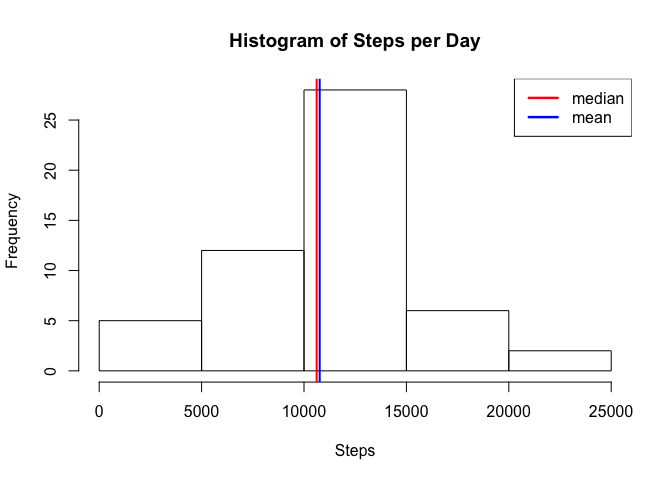
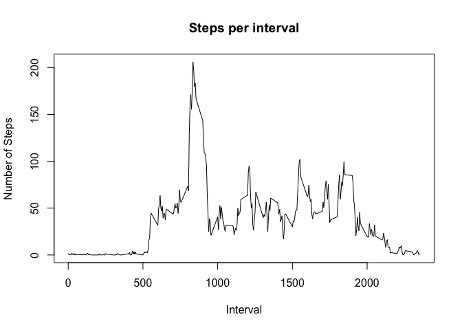
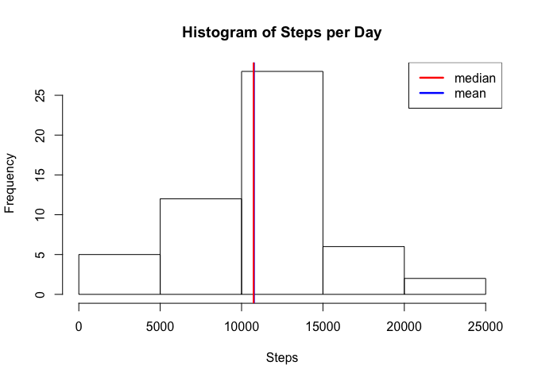
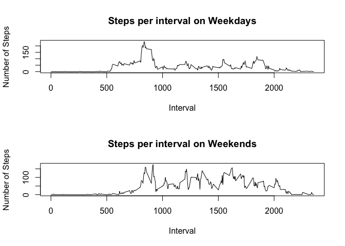

# Reproducable Research - Peer Assignment 1
Steve Petersen  
April 19, 2015  

## Introduction and Context

It is now possible to collect a large amount of data about personal movement using activity monitoring devices such as a Fitbit, Nike Fuelband, or Jawbone Up. These type of devices are part of the "quantified self" movement -- a group of enthusiasts who take measurements about themselves regularly to improve their health, to find patterns in their behavior, or because they are tech geeks. But these data remain under-utilized both because the raw data are hard to obtain and there is a lack of statistical methods and software for processing and interpreting the data.

This assignment makes use of data from a personal activity monitoring device. This device collects data at 5 minute intervals through out the day. The data consists of two months of data from an anonymous individual collected during the months of October and November, 2012 and include the number of steps taken in 5 minute intervals each day.

This document uses the following libraries:

```r
library(dplyr)
library(timeDate)
```

## Loading and preprocessing the data

The data for this assignment can be downloaded from the course web site: [Activity monitoring data](https://d396qusza40orc.cloudfront.net/repdata%2Fdata%2Factivity.zip).

The variables included in this dataset are:

* __steps__: Number of steps taking in a 5-minute interval (missing values are coded as NA)

* __date__: The date on which the measurement was taken in YYYY-MM-DD format
  
* __interval__: Identifier for the 5-minute interval in which measurement was taken

The dataset is stored in a comma-separated-value (CSV) file and there are a total of 17,568 observations in this dataset.

The following R code loads, reformulates and shows a summary of the data:

```r
activity <- read.csv("activity.csv")
activity$date <- as.Date(activity$date, format = "%Y-%m-%d")
activity$weekend <- factor(weekdays(activity$date), levels = c("Saturday", "Sunday", "Monday", "Tuesday", "Wednesday", "Thursday", "Friday"), labels = c("Weekend", "Weekend", "Weekday", "Weekday", "Weekday", "Weekday", "Weekday"))
```

```
## Warning in `levels<-`(`*tmp*`, value = if (nl == nL) as.character(labels)
## else paste0(labels, : duplicated levels in factors are deprecated
```

```r
summary(activity)
```

```
## Warning in `levels<-`(`*tmp*`, value = if (nl == nL) as.character(labels)
## else paste0(labels, : duplicated levels in factors are deprecated
```

```
##      steps             date               interval         weekend     
##  Min.   :  0.00   Min.   :2012-10-01   Min.   :   0.0   Weekend: 4608  
##  1st Qu.:  0.00   1st Qu.:2012-10-16   1st Qu.: 588.8   Weekend:    0  
##  Median :  0.00   Median :2012-10-31   Median :1177.5   Weekday:12960  
##  Mean   : 37.38   Mean   :2012-10-31   Mean   :1177.5   Weekday:    0  
##  3rd Qu.: 12.00   3rd Qu.:2012-11-15   3rd Qu.:1766.2   Weekday:    0  
##  Max.   :806.00   Max.   :2012-11-30   Max.   :2355.0   Weekday:    0  
##  NA's   :2304                                           Weekday:    0
```


## What is mean total number of steps taken per day?

The steps-per-day data can be visualized using a histogram:

```r
stepsperday <- activity %>% group_by(date) %>% summarise(step_total = sum(steps))
mean <- mean(stepsperday$step_total, na.rm=TRUE)
median <- median(stepsperday$step_total, na.rm=TRUE)
hist(stepsperday$step_total, main="Histogram of Steps per Day", xlab="Steps", ylab="Frequency")
abline(v = mean, col = "blue", lwd = 2)
abline(v = jitter(median), col = "red", lwd = 2)
legend("topright", legend = c("median", "mean"), lty=c(1,1), lwd=c(2.5,2.5), col = c("red", "blue"))
```

 

From the graph above, you can see that the mean is 1.0766189\times 10^{4} steps per day, and the median is 10765.


## What is the average daily activity pattern?

```r
stepsperinterval <- activity %>% group_by(interval) %>% summarise(step_average = mean(steps, na.rm=TRUE))
plot(stepsperinterval$interval, stepsperinterval$step_average, type="l", main="Steps per interval", xlab="Interval", ylab="Number of Steps")
```

 

```r
maxInterval <- stepsperinterval[which.max(stepsperinterval$step_average),]$interval
```

The 5-minute interval, on average across all the days in the dataset, that contains the maximum number of steps is 835.


## Imputing missing values

```r
incomplete_cases = length(which(!complete.cases(activity)))
```

The number of incomplete cases in the data set is 2304.

A simple way to impute the missing data is to set it to the mean per interval:


```r
stepsperinterval <- activity %>% group_by(interval) %>% summarise(step_total = sum(steps))
meanperinterval <- mean(stepsperinterval$step_total, na.rm=TRUE)
activity$steps[!complete.cases(activity)] = meanperinterval
```

And re-run the graphs from above:


```r
stepsperday2 <- activity %>% group_by(date) %>% summarise(step_total = sum(steps))
mean2 <- mean(stepsperday2$step_total, na.rm=TRUE)
median2 <- median(stepsperday2$step_total, na.rm=TRUE)
hist(stepsperday2$step_total, main="Histogram of Steps per Day", xlab="Steps", ylab="Frequency")
abline(v = mean2, col = "blue", lwd = 2)
abline(v = jitter(median2), col = "red", lwd = 2)
legend("topright", legend = c("median", "mean"), lty=c(1,1), lwd=c(2.5,2.5), col = c("red", "blue"))
```

 

From the graph above, you can see that the new mean is 1.0766189\times 10^{4} steps per day, and the median is 1.0765\times 10^{4}, which change the median from above.


## Are there differences in activity patterns between weekdays and weekends?

The weekday 


```r
stepsperintervalweekday <- activity %>% group_by(interval) %>% filter(weekend=="Weekday") %>% summarise(step_average = mean(steps, na.rm=TRUE))
stepsperintervalweekend <- activity %>% group_by(interval) %>% filter(weekend=="Weekend") %>% summarise(step_average = mean(steps, na.rm=TRUE))
par(mfrow=c(2,1))
plot(stepsperintervalweekday$interval, stepsperintervalweekday$step_average, type="l", main="Steps per interval on Weekdays", xlab="Interval", ylab="Number of Steps")
plot(stepsperintervalweekend$interval, stepsperintervalweekend$step_average, type="l", main="Steps per interval on Weekends", xlab="Interval", ylab="Number of Steps")
```

 
